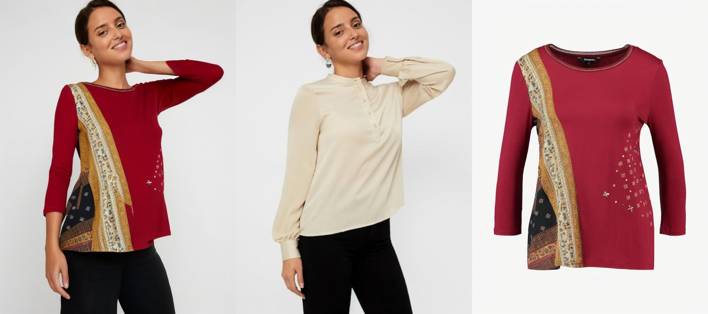
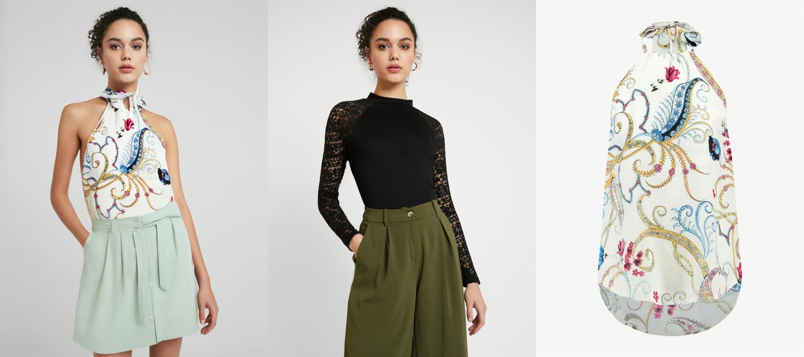

# DT_TRYON: Using diffusion models to solve the problem of image generation in the fashion field

## Introduction
- pros
  - Minimalist project structure. Only a few files included
  - Continuously updating new features in the future, fully anticipating
  - Follow industry trends and reproduce hot papers
## News

**May 21st, 2024**
- Release SDXL finetune scripts & sample data
- download datasets from [Baidu](https://pan.baidu.com/s/1VQM3Ymyw92qRVs8RWrB_qg?pwd=5556)
- You can find running command in 'command' file
- Some key points when you finetune your model
  - you need prepare Very High Quality data according your project needs
  - 2k-4k pictures will be enough
  - train your model through many epoch. I get the best result on 100 epoch
  - high resolution is very important. I use 960*1280 here
  - the quality of result from finetune model is far better than the ordinary model
  
**April 22th, 2024**
- Release animation step1 train scripts
- download datasets from [Baidu](https://pan.baidu.com/s/1VQM3Ymyw92qRVs8RWrB_qg?pwd=5556)
- place downloaded files to your directory
- change your directory in config file
- run following cmd
- I only release partial data, so you need to prepare your data as i do
- ## Train
  ```bash
  python -m accelerate.commands.launch --num_processes=2 train_script.py -c configs/train/animate_step1.yaml
  ```
- 

**April 8th, 2024**
- Release animation
- download pretrained models and datasets from [Baidu](https://pan.baidu.com/s/1VQM3Ymyw92qRVs8RWrB_qg?pwd=5556)
- place downloaded files to your directory
- change your directory in config file
- run following cmd
- I use UBC fashion dataset to train step2. I release step2 training & testing scripts
- Step1 training script will be released later
- ## Inference
    ```bash
    python test_script.py -c configs/test/animate_step2.yaml
    ```
- ## Train
  ```bash
  python -m accelerate.commands.launch --main_process_port=28500 --num_processes=2 train_script.py -c configs/train/animate_step2.yaml
  ```
-  

**April 2nd, 2024**
- Release TryOn Demo
  ```bash
  python -m deploy.viton.viton_demo
  ```
  - 


**March 26th, 2024**
- Release TryOn
  - ## Inference
    ```bash
    python test_script.py -c configs/test/viton.yaml
    ```
  - ## Train
    ```bash
    python train_script.py -c configs/train/viton.yaml
    ```
  - 
  - 
  - 
  - [more results](https://pan.baidu.com/s/1VQM3Ymyw92qRVs8RWrB_qg?pwd=5556)
  - including inference code and train code
  - provide pretrained model files
  - provide dataset
  - core ideas largely come from [Animate Anyone](https://humanaigc.github.io/animate-anyone/) and I made some modifications
    - reporduce model structure using huggingface diffusers
    - remove pose guider and cross attention from Unet because I find them no use
    - a different cross attention structure, with which you can input any size of image of condition
    - i do not reproduce temporal attention 
    - i use HRViton dataset to train the virtual tryon model


## Installation
- install [xformers](https://github.com/facebookresearch/xformers) at the same time pytorch will be installed
- pip install -r requirements.txt
- download pretrained models and datasets from [Baidu](https://pan.baidu.com/s/1VQM3Ymyw92qRVs8RWrB_qg?pwd=5556)
- place model files into checkpoints
- place dataset to your directory
- change directory path in config files